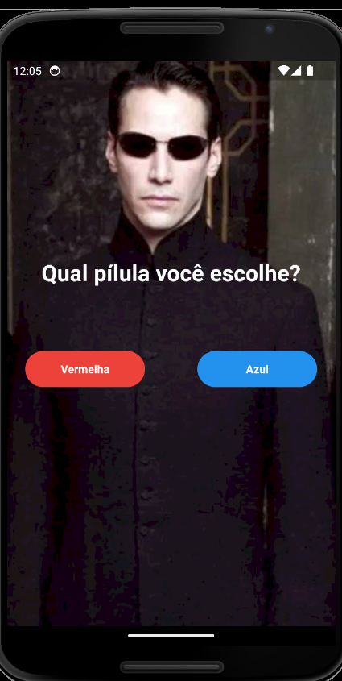
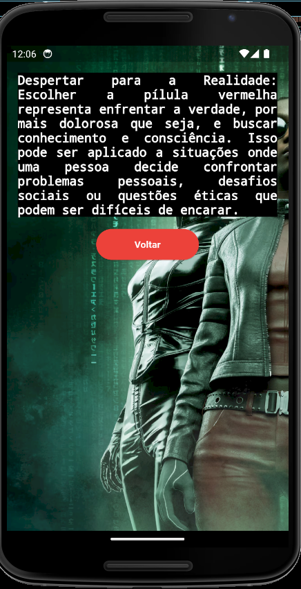
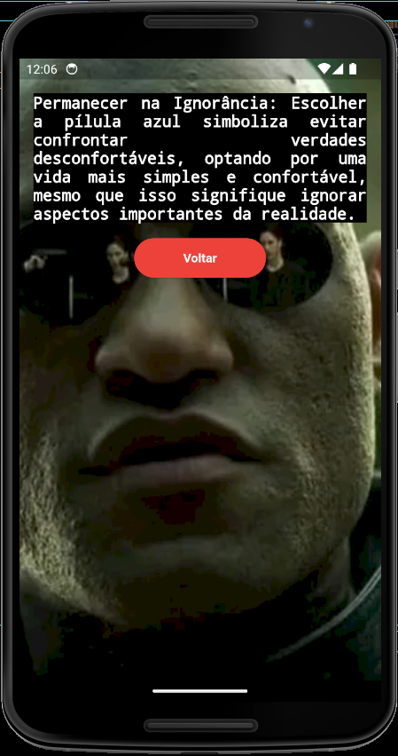
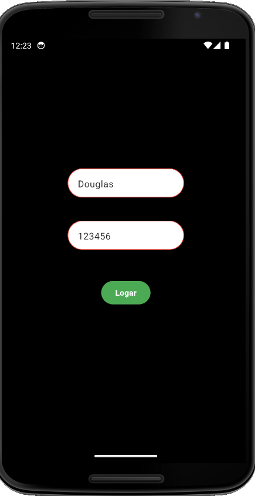
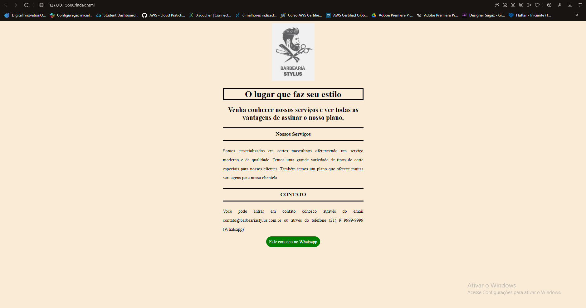
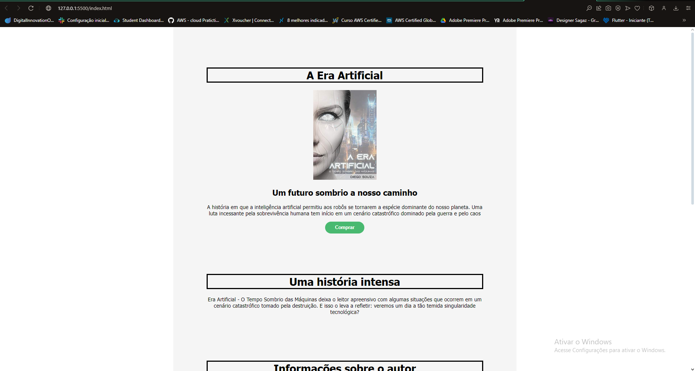
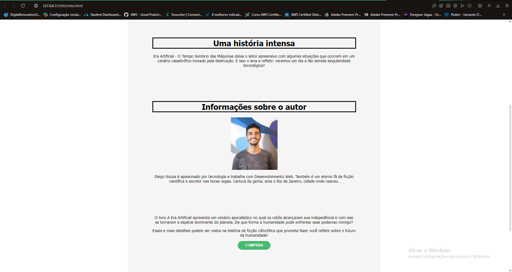

# Mini Projetos para Aprendizado

## Aqui está alguns mini projetos que fiz para fins de conhecimento e estar me atualizado em minhas lingugagens de programação que atuo.

# App Matrix ( Treino de routes apenas )

# App TextField (Treino de passar informações de tela)

# Projetos com HTML e CSS Apenas

# Site de uma barbearia

# Site de Livros

